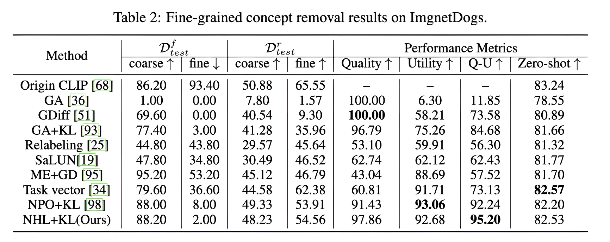
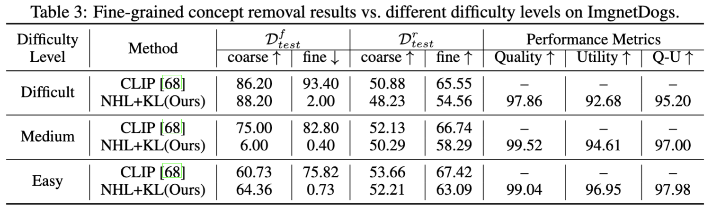

# Lifting Data-Tracing Machine Unlearning to Knowledge-Tracing for Foundation Models
<div align="center">

<div>
    <a href='' target='_blank'>Yuwen Tan</a> and <a href='' target='_blank'>Boqing Gong</a>
</div>

<div>
Department of Computer Science, Boston University &emsp;
</div>
</div>

The code repository for "[Lifting Data-Tracing Machine Unlearning to
Knowledge-Tracing for Foundation Models](https://arxiv.org/abs/2403.19979)" in PyTorch. 
    

## News

[06/2025] 🌟 [arXiv](https://arxiv.org/abs/2403.19979) paper has been released.

[06/2025] 🌟 The code repository of the case study has been released.


## Abstract
Machine unlearning removes certain training data points and their influence on AI models (e.g. when a data owner revokes their decision to allow models to learn from the data). In this position paper, we propose to lift data-tracing machine unlearning to knowledge-tracing for foundation models (FMs). We support this position based on practical needs and insights from cognitive studies. Practically, tracing data cannot meet the diverse unlearning requests for FMs, which may be from regulators, enterprise users, product teams, etc., having no access to FMs' massive training data. Instead, it is convenient for these parties to issue an unlearning request about the knowledge or capability FMs (should not) possess. Cognitively, knowledge-tracing unlearning aligns with how the human brain forgets more closely than tracing individual training data points. Finally, we provide a concrete case study about a vision-language FM to illustrate how an unlearner might instantiate the knowledge-tracing machine unlearning paradigm. 
<div align="center">

</div>


## Case Study
<div align="center">

</div>
<p></p>

Following this work's position, we provide a concrete case study about Contrastive Language-Image Pretraining [CLIP](https://github.com/openai/CLIP) to bridge the position with real-world applications and, in return, explore the position in depth, spanning multiple factors and perspectives. We envision that Oudi Inc., a car manufacturer and an enterprise user of the CLIP model, has retired their O1 sedan for some reason. Accordingly, Oudi's product team requests that the Oudi O1 concept be unlearned from CLIP. An unlearner is equipped with existing MU methods developed in the research community but realizes they all operate on the training data points. The unlearner cannot access CLIP's training data; instead, they assemble a set of exemplar Oudi O1 images as the proxy forgetting set (but no retention set for convenience).


<p></p>

## Results
<div>
The following table shows the main results of our proposed method and other SOTA methods. Please note that there might be slight variations in results based on the type and quantity of NVIDIA GPUs.
</div>

<div align="center">

</div>
<div align="center">

</div>


## Requirements
### Dependencies
1. [torch 1.12.1](https://github.com/pytorch/pytorch)
2. [torchvision 0.13.1](https://github.com/pytorch/vision)

For more information about the environment requirements, please see ./requirements.txt.

### Datasets
We provide the orginal datasets as follows:
- **ImageNet-1k**: Reference [ImageNet-1k](https://mmlab.ie.cuhk.edu.hk/datasets/comp_cars/index.html)
- **CompCars**: Reference [CompCars](https://mmlab.ie.cuhk.edu.hk/datasets/comp_cars/index.html)

Our training sets are subsets of the original datasets. Please modify the dataset paths in ./data/.../train.jsonl and ./data/.../test.jsonl to match your local setup. Additionally, specify the dataset root directory in ./dataloader/data_utils.py.

For general capability evaluation, we include the following datasets: [cifar100](https://www.cs.toronto.edu/~kriz/cifar.html), [Stanford Cars](https://github.com/jhpohovey/StanfordCars-Dataset), [Food 101](https://data.vision.ee.ethz.ch/cvl/datasets_extra/food-101/), [Flower 102](https://www.robots.ox.ac.uk/~vgg/data/flowers/102/) , [Catech101](https://data.caltech.edu/records/mzrjq-6wc02) and [OxfordPet](https://www.robots.ox.ac.uk/~vgg/data/pets/). Please download these datasets before running the evaluation.

## Training Scripts
You can specify your own unlearning targets, datasets, and training parameters to train a customized unlearning model using train.py.

In our setup, we provide ready-to-use scripts under the scripts/ directory for all compared methods. These scripts define the unlearning targets and hyperparameters used throughout the paper.
```
python Unlearning/train.py 

for ImgnetDogs:
bash ./scripts/train/Subsetdog_train.sh

for CompCars-S:
bash ./scripts/train/Compcars_train.sh
```

## Evaluation Scripts

Evaluate the forgetting quality and model utility:

python Unlearning/evaluate.py 

for ImgnetDogs:
bash ./scripts/evaluate_retain/evaluate_retain_Subsetdog.sh

for CompCars-S:
bash /scripts/evaluate_retain/evaluate_retain_Compcars.sh
```
Evaluate model generalizability:

python Unlearning/evaluate_retain.py 

for ImgnetDogs:
bash ./scripts/evaluate_retain/evaluate_retain_Subsetdog.sh

for CompCars-S:
bash /scripts/evaluate_retain/evaluate_retain_Compcars.sh
```

## Citation
If you find this useful in your research, please consider citing:
```
@article{tan2024semantically,
 title={Semantically-Shifted Incremental Adapter-Tuning is A Continual ViTransformer},
 author={Tan, Yuwen and Zhou, Qinhao and Xiang, Xiang and Wang, Ke and Wu, Yuchuan and Li, Yongbin},
 journal={arXiv preprint arXiv:2403.19979},
 year={2024}
}

```

## Acknowledgment
This repo is based on [CLIP](https://github.com/openai/CLIP),[NPO](https://github.com/licong-lin/negative-preference-optimization) ,and [SaLUN](https://github.com/OPTML-Group/Unlearn-Saliency).

Thanks for their wonderful work!!!

## Correspondence
If you have any question about this project, please contact yuwentan@bu.edu